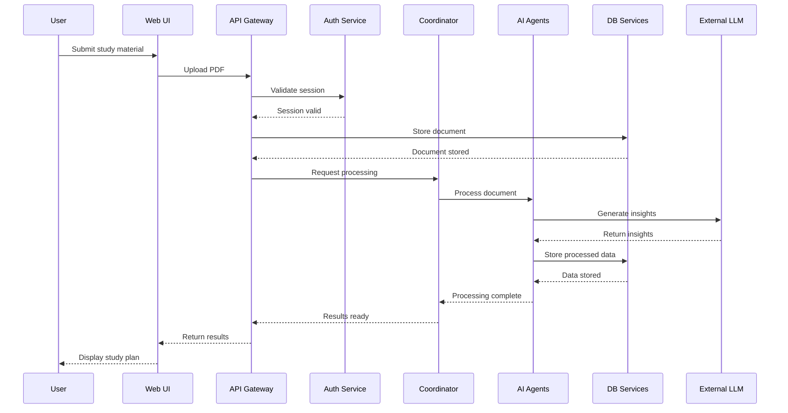

# Purrfect System Design Document

## Overview

Purrfect is an AI-powered educational platform that provides personalized learning experiences through a multi-agent architecture. The system integrates various AI components to help students with study planning, exam preparation, flashcard creation, and collaborative learning.

## High-Level Design (HLD)

### System Architecture


The Purrfect platform is structured in multiple layers:

1. **Presentation Layer**
   - Web UI (Flask-based templates)
   - Socket.IO for real-time collaboration
   - Responsive design for multi-device support

2. **API Layer**
   - RESTful API endpoints
   - WebSocket endpoints for real-time functionality
   - Authentication and authorization middleware

3. **Orchestration Layer**
   - Intent routing and request processing
   - Multi-agent coordination
   - Session management

4. **Core Services Layer**
   - Study planning service
   - Document processing service
   - Flashcard generation service
   - Exam preparation service
   - Collaborative learning service

5. **Data Layer**
   - Relational database (PostgreSQL)
   - Vector database (Qdrant)
   - File storage (local/cloud)

6. **External Integrations**
   - LLM APIs (Google Gemini)
   - Embedding APIs
   - OCR services

### Key Components

#### 1. Authentication Service
- Handles user registration, login, and session management
- Implements JWT or session-based authentication
- Integrates with Flask-Login for session handling

#### 2. Document Processing Engine
- Extracts text content from PDFs and other document formats
- Processes and structures the extracted information
- Creates embeddings for semantic search functionality

#### 3. AI Agent Coordinator
- Manages the routing of requests to appropriate AI agents
- Orchestrates multi-step agent interactions
- Implements fallback mechanisms for agent failures

#### 4. Study Plan Generator
- Analyzes learning materials to extract key topics
- Creates personalized study schedules based on user preferences
- Implements intelligent time allocation based on topic complexity

#### 5. RAG (Retrieval Augmented Generation) System
- Retrieves relevant context from vector database
- Enhances LLM responses with domain-specific knowledge
- Tracks usage and improves results through feedback loops

#### 6. Collaborative Study Environment
- Enables real-time collaboration through WebSockets
- Supports shared whiteboards and document annotations
- Facilitates peer learning through shared study rooms

### System Interactions



### Scalability Considerations

- **Horizontal Scaling**: The service-oriented architecture allows individual services to scale independently based on demand.
- **Load Balancing**: Implemented at API layer to distribute requests evenly.
- **Caching**: Multi-level caching strategy with Redis for frequently accessed data.
- **Asynchronous Processing**: Long-running tasks like PDF processing handled asynchronously.
- **Database Sharding**: Ready for implementation as user base grows.

### Fault Tolerance and Reliability

- **Circuit Breakers**: Prevent cascading failures when external services are unavailable.
- **Fallback Mechanisms**: Alternative processing paths when primary methods fail.
- **Graceful Degradation**: Core functionality remains available even when advanced features fail.
- **Monitoring and Alerting**: Comprehensive system health tracking.

## Low-Level Design (LLD)

### Database Schema

```
┌─────────────┐       ┌─────────────┐       ┌─────────────┐
│    User     │       │  StudyPlan   │       │   ExamPlan  │
├─────────────┤       ├─────────────┤       ├─────────────┤
│ id          │       │ id          │       │ id          │
│ username    │       │ user_id     │──┐    │ user_id     │──┐
│ email       │       │ title       │  │    │ title       │  │
│ password    │       │ plan_summary│  │    │ exam_date   │  │
│ created_at  │       │ topics      │  │    │ plan_details│  │
│ last_login  │       │ schedule    │  │    │ created_at  │  │
└─────────────┘       │ exam_date   │  │    └─────────────┘  │
        ▲             │ start_date  │  │                     │
        │             └─────────────┘  │                     │
        │                              │                     │
        └──────────────────────────────┴─────────────────────┘
                                                              
┌─────────────┐       ┌─────────────┐       ┌─────────────┐
│  StudyRoom  │       │ RAGIngestEvent│     │ RAGUsageLog │
├─────────────┤       ├─────────────┤       ├─────────────┤
│ id          │       │ id          │       │ id          │
│ creator_id  │──┐    │ user_id     │──┐    │ user_id     │──┐
│ name        │  │    │ file_name   │  │    │ query       │  │
│ description │  │    │ collection  │  │    │ results     │  │
│ created_at  │  │    │ status      │  │    │ timestamp   │  │
│ is_active   │  │    │ timestamp   │  │    └─────────────┘  │
└─────────────┘  │    └─────────────┘  │                     │
                 │                      │                     │
                 │                      │                     │
                 └──────────────────────┴─────────────────────┘
                                       User
```

### Component Design

#### Study Plan Service

```python
class StudyPlanService:
    def __init__(self, repository, ai_service, pdf_processor):
        self.repository = repository
        self.ai_service = ai_service
        self.pdf_processor = pdf_processor
    
    def create_study_plan(self, user_id, form_data, pdf_files):
        # Process PDF files
        combined_text = self.pdf_processor.process_pdf_files(pdf_files)
        
        # Extract topics using AI
        topics = self.ai_service.extract_important_topics(combined_text)
        
        # Create study schedule
        schedule = self.ai_service.create_enhanced_study_schedule(form_data, topics)
        
        # Save plan to database
        plan = self.repository.create(
            user_id=user_id,
            title=form_data.get('exam_name'),
            plan_summary=schedule.get('summary'),
            topics=topics,
            detailed_schedule=schedule,
            exam_date=form_data.get('exam_date'),
            prep_start_date=form_data.get('start_date')
        )
        
        return plan
```

#### RAG Implementation

```python
class RAGService:
    def __init__(self, vector_db, llm_client, repository):
        self.vector_db = vector_db
        self.llm_client = llm_client
        self.repository = repository
    
    async def ingest_document(self, user_id, file_path):
        # Extract text from document
        text = self.extract_text(file_path)
        
        # Split text into chunks
        chunks = self.text_splitter.split_text(text)
        
        # Create embeddings and store in vector DB
        embeddings = await self.create_embeddings(chunks)
        collection_name = f"user_{user_id}_docs"
        self.vector_db.add_embeddings(collection_name, embeddings)
        
        # Log ingest event
        self.repository.log_ingest(user_id, file_path, collection_name)
        
        return {"status": "success", "chunks": len(chunks)}
    
    async def query(self, user_id, query_text):
        # Create query embedding
        query_embedding = await self.create_embedding(query_text)
        
        # Retrieve relevant context
        collection_name = f"user_{user_id}_docs"
        results = self.vector_db.query(collection_name, query_embedding, limit=5)
        
        # Construct prompt with context
        context = "\n".join([r.text for r in results])
        prompt = f"Context: {context}\n\nQuestion: {query_text}\n\nAnswer:"
        
        # Generate response with LLM
        response = await self.llm_client.generate(prompt)
        
        # Log usage
        self.repository.log_usage(user_id, query_text, response)
        
        return response
```

### Authentication Flow

```python
@auth_bp.route('/login', methods=['GET', 'POST'])
def login():
    if request.method == 'POST':
        email = request.form.get('email')
        password = request.form.get('password')
        
        # Find user by email
        user = User.query.filter_by(email=email).first()
        
        # Verify password
        if user and check_password_hash(user.password, password):
            # Create session
            login_user(user)
            
            # Log user activity
            UserLog.create(
                user_id=user.id,
                action="login",
                ip_address=request.remote_addr
            )
            
            # Redirect to dashboard
            return redirect(url_for('dashboard'))
        
        flash('Please check your login details and try again.')
    
    return render_template('login.html')
```

### API Endpoints

```python
# Study Plan API
@study_plan.route('/create-study-plan', methods=['POST'])
@login_required
def create_study_plan():
    # Get form data
    form_data = request.form
    
    # Get uploaded files
    pdf_files = request.files.getlist('pdf_files')
    
    try:
        # Process uploaded PDFs
        combined_text, documents, collection_name = process_pdf_files(pdf_files)
        
        # Extract important topics
        topics_data = extract_important_topics(combined_text)
        
        # Create enhanced study schedule
        schedule_data = create_enhanced_study_schedule(form_data, topics_data)
        
        # Store in session for preview
        session['new_study_plan'] = {
            'title': form_data.get('exam_name'),
            'topics': topics_data,
            'schedule': schedule_data,
            'form_data': {k: v for k, v in form_data.items()}
        }
        
        return redirect(url_for('study_plan.studyplan'))
    except Exception as e:
        flash(f"Error creating study plan: {str(e)}")
        return redirect(url_for('study_plan.forms'))
```

### Websocket Implementation

```python
def register_studyroom_socket_events(socketio):
    @socketio.on('join')
    def handle_join(data):
        room_id = data.get('room_id')
        if not room_id:
            return
        
        # Join socket.io room
        join_room(room_id)
        
        # Get study room data
        study_room = StudyRoom.query.get(room_id)
        if not study_room:
            return
        
        # Broadcast join message
        emit('user_joined', {
            'user': current_user.username,
            'message': f"{current_user.username} has joined the room"
        }, room=room_id)
        
        # Log activity
        UserLog.create(
            user_id=current_user.id,
            action="join_room",
            details={"room_id": room_id}
        )
    
    @socketio.on('message')
    def handle_message(data):
        room_id = data.get('room_id')
        message = data.get('message')
        
        if not room_id or not message:
            return
        
        # Broadcast message to room
        emit('new_message', {
            'user': current_user.username,
            'message': message,
            'timestamp': datetime.now().isoformat()
        }, room=room_id)
```

## Technical Debt and Optimization Opportunities

### Current Technical Debt

1. **Monolithic Components**: Some features are tightly coupled and should be refactored into microservices.
2. **Direct Database Access**: Some routes bypass service layer and access database directly.
3. **Synchronous Processing**: PDF processing happens synchronously, blocking the user experience.
4. **Limited Test Coverage**: Automated testing is not comprehensive.
5. **Hardcoded Configuration**: Some configuration values are hardcoded rather than environment variables.

### Optimization Opportunities

1. **Microservices Architecture**: Refactor into independent microservices for better scaling.
2. **Message Queue Implementation**: Add RabbitMQ/Kafka for asynchronous processing.
3. **Service Layer Consistency**: Ensure all database access goes through service layer.
4. **API Gateway**: Implement proper API gateway for security and rate limiting.
5. **Enhanced Caching**: Implement more sophisticated caching strategy.
6. **Containerization**: Move to Docker-based deployment for consistency.

## Performance Considerations

### Database Performance

1. **Indexing Strategy**:
   - Primary indices on all ID fields
   - Composite indices on frequently queried fields (user_id + created_at)
   - Full-text search indices on text fields

2. **Query Optimization**:
   - Avoid N+1 query problems through eager loading
   - Pagination for large result sets
   - Prepared statements for frequent queries

3. **Connection Pooling**:
   - Implemented with SQLAlchemy to manage database connections efficiently

### AI Service Performance

1. **Batch Processing**:
   - Embeddings created in batches for efficiency
   - Document chunking optimized for context retrieval

2. **Caching Layer**:
   - LLM responses cached for common queries
   - Embedding results cached to reduce API calls

3. **Asynchronous Processing**:
   - Background workers for document processing
   - Streaming responses for long-running operations

## Security Considerations

1. **Authentication & Authorization**:
   - JWT-based authentication with proper expiration
   - Role-based access control (RBAC)
   - CSRF protection for all forms

2. **Data Protection**:
   - All sensitive data encrypted at rest
   - TLS for data in transit
   - Personally identifiable information (PII) handled according to regulations

3. **Input Validation**:
   - All user inputs validated and sanitized
   - Parameterized queries to prevent SQL injection
   - Content Security Policy (CSP) headers

4. **Rate Limiting**:
   - API rate limiting to prevent abuse
   - Graduated response to suspicious activity

## Deployment Architecture

### Development Environment
- Local development using Docker Compose
- SQLite database for simplified setup
- Mock services for external dependencies

### Staging Environment
- Deployed on Render or similar PaaS
- PostgreSQL database with limited scaling
- Integration with actual external services
- Automated testing environment

### Production Environment
- Deployed on Render or AWS Elastic Beanstalk
- Fully scaled PostgreSQL database
- Redis for caching and session management
- CDN for static assets
- Automated backup and disaster recovery

## Monitoring and Observability

1. **Logging Strategy**:
   - Structured logging with context information
   - Log aggregation with Elasticsearch
   - Log levels properly used (DEBUG, INFO, WARNING, ERROR)

2. **Metrics Collection**:
   - Application metrics (response time, error rates)
   - System metrics (CPU, memory, disk)
   - Business metrics (active users, study plans created)

3. **Alerting**:
   - Alert on critical errors and performance degradation
   - On-call rotation for production issues
   - Runbooks for common problems

## Conclusion

The Purrfect platform demonstrates a thoughtfully designed architecture that balances immediate functionality with future scalability. The system leverages modern AI capabilities through a multi-agent architecture while maintaining a clean separation of concerns across layers.

Key architectural strengths include:

1. **Domain-Driven Design**: Clear separation between entity models, repositories, services, and controllers
2. **Layered Architecture**: Well-defined layers with proper abstraction
3. **Intelligent Fallback Mechanisms**: Graceful degradation when components fail
4. **Scalable Data Model**: Designed for growth with proper relationships
5. **Multi-Agent AI Integration**: Modular AI capabilities that can evolve independently

Future architectural improvements would focus on moving from a monolithic to microservices architecture, implementing a robust message queue for asynchronous processing, and enhancing the caching strategy for improved performance.